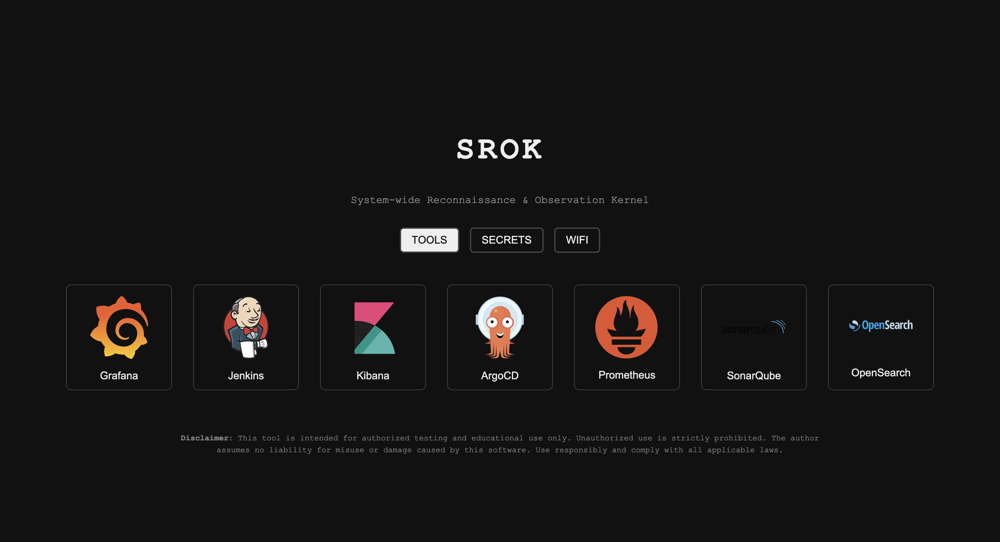
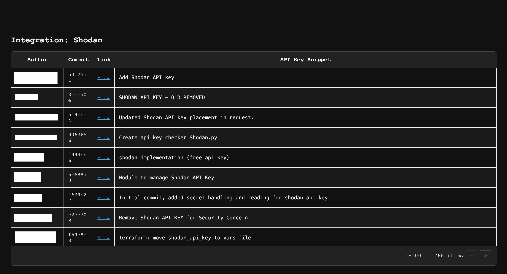

# SROK 🕷️

**Srok** is a powerful Rust-powered full-stack web reconnaissance tool. It combines web scraping capabilities with API integrations to help security researchers and developers identify and analyze web applications at scale.


[](https://hub.docker.com/r/mikeengineering/srok)
[](https://aquasecurity.github.io/trivy/)
[](https://www.rust-lang.org/)
[](https://leptos.dev/)
[](https://docs.rs/axum/latest/axum/)


**By clicking the link, you acknowledge that you have read and understood the [disclaimer](#disclaimer) and agree to use this tool solely for lawful, ethical, and authorized purposes. You accept full responsibility for your actions, and the author disclaims all liability for misuse.**

You can try it out [here](https://srok.mikeengineering.org)


### Vulnerability Scanning


```(shell)
> trivy image -q  docker.io/mikeengineering/srok:1.0.0  --scanners vuln

docker.io/mikeengineering/srok:1.0.0 (debian 12.10)

Total: 0 (UNKNOWN: 0, LOW: 0, MEDIUM: 0, HIGH: 0, CRITICAL: 0)
```


## Quick Start

```bash
make compile
make run
```

## Getting Started

### Prerequisites

- Rust (`rustup`)
- wasm32 target: `rustup target add wasm32-unknown-unknown`
- Trunk: `cargo install trunk`
- Leptos CLI: `cargo install cargo-leptos`

**Note:** 
You will need to set both the `SHODAN_API_KEY` & `GITHUB_TOKEN` environment variables to use the TOOLS/SECRETS integrations respectively.

```bash
echo -e "SHODAN_API_KEY=YOUR_SHODAN_API_KEY\nGITHUB_TOKEN=YOUR_GITHUB_TOKEN" > .env
```

You can try to get a free Shodan api key using this tool with just using a `GITHUB_TOKEN` ( which is free and generated in your github account settings under access tokens ).

Since this is just a research project, I will not reveal any keys found! Use at your own risk!

### Run Locally

```bash
cargo leptos watch
```

Visit [http://localhost:3000](http://localhost:3000) to access the application.

## Screenshots






## Contributing

Contributions are welcome! Please feel free to submit a Pull Request.

## Disclaimer

This tool is intended for educational purposes only. It is not intended to be used for any illegal activities, including but not limited to unauthorized access to computer systems, networks, or data. The author of this tool does not condone or endorse any illegal activities and is not responsible for any misuse of this tool.

This tool is only for testing and can only be used where strict consent has been given. Do not use it for illegal purposes! It is the end user’s responsibility to obey all applicable local, state and federal laws. I assume no liability and am not responsible for any misuse or damage caused by this tool and software.

Distributed under the GNU License.
